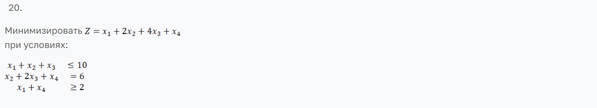
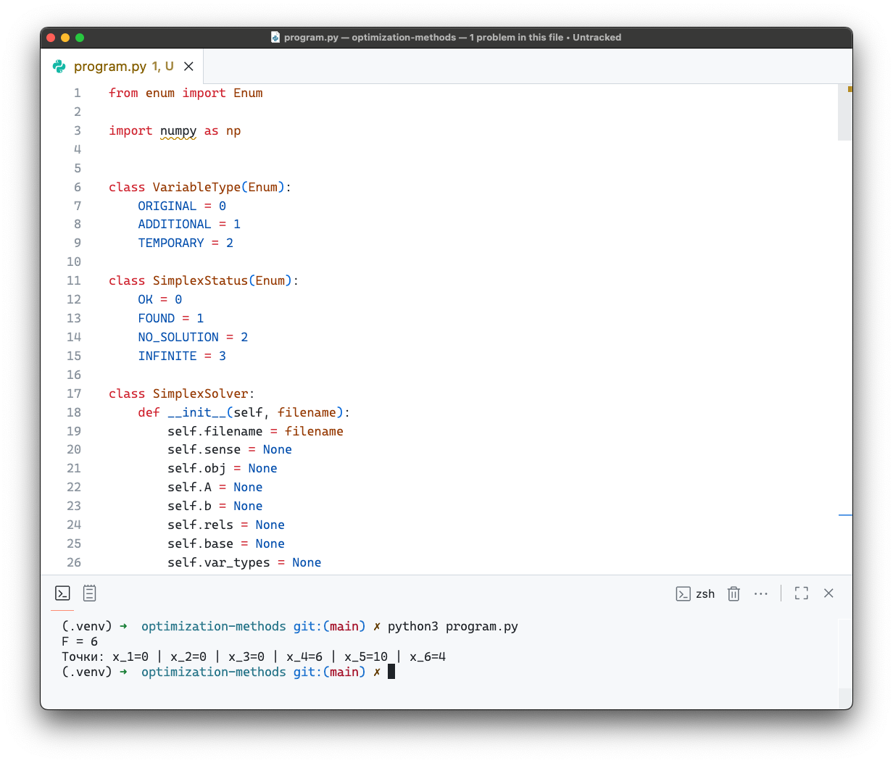
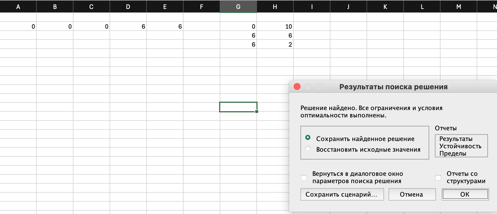

# Отчет по выполнению работы: Решение задач линейного программирования методом Симплекса

Преображенский Артемий Евгеньевич, поток 1.1, вариант 20

[Подкаст](https://drive.google.com/file/d/172BhGBlGAJ-om4OylIJCR0blYDrAxaQ6/view?usp=sharing)

---

## Краткое описание алгоритма решения ЗЛП

1. **Загрузка задачи**
   Чтение файла с коэффициентами целевой функции и ограничений. Разбор знаков ограничений.

2. **Приведение к каноническому виду** (`prepare_canonical`)  
   - Приведение минимизации к максимизации при необходимости.  
   - Инвертирование строк с отрицательными правыми частями.  
   - Добавление дополнительных и временных переменных, обновление базиса.  

3. **Вспомогательная задача (Фаза I)** (`build_auxiliary`, `solve_auxiliary`)  
   - Построение таблицы с временными переменными.  
   - Минимизация суммы временных переменных для поиска допустимого базиса.  
   - Если сумма временных переменных ≠ 0 → задача не имеет решения.  

4. **Основная задача (Фаза II)** (`solve_main`)  
   - Удаление временных переменных.  
   - Решение исходной задачи симплекс-методом.  
   - Вычисление оптимального значения целевой функции и значений переменных.

5. **Симплекс-ядро** (`run_simplex_core`)  
   - Выбор ведущего столбца (первый положительный коэффициент).  
   - Выбор ведущей строки (правило минимального отношения).  
   - Выполнение поворота (pivot).  
   - Повтор до оптимальности или выявления бесконечности решения.

Ниже приведена схема:


## Инструкция по развертыванию и запуску программы

1. Установить Python 3.10+ и библиотеку `numpy`:
```bash
pip install numpy
```

2.	Подготовить файлы программы и входной файл input.txt с форматом:

	•	Первая строка: коэффициенты целевой функции + min/max

	•	Последующие строки: ограничения (<=, >=, =)

```
3 2 max
1 2 <= 4
2 1 >= 3
```

3. Ввести путь до файла
```
if __name__=="__main__":
    SimplexSolver(<путь до файла>).run()
```

4. Запустить программу
```
python3 program.py
```

## Демонстрация работы

Условие:


Ответ:


Проверим через excel


## Рефлективный вывод

Данная работа показала, что вручную реализовывать симплекс-метод слишком трудоемко — много мелких деталей, особенно с искусственными переменными и базисом, проверкой ведущих строк и фазами I и II. Понравилось, что с помощью  NumPy процесс можно сильно упростить, поскольку без автоматизации вычислений легко потеряться в индексах. В целом, работа дала полезный практический опыт в алгоритмизации и обработке линейных задач, однако в будущем хотелось бы иметь возможность пользоваться библиотеками (сейчас работа довольно сложная)
