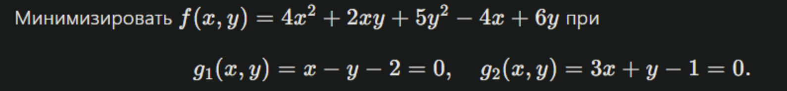
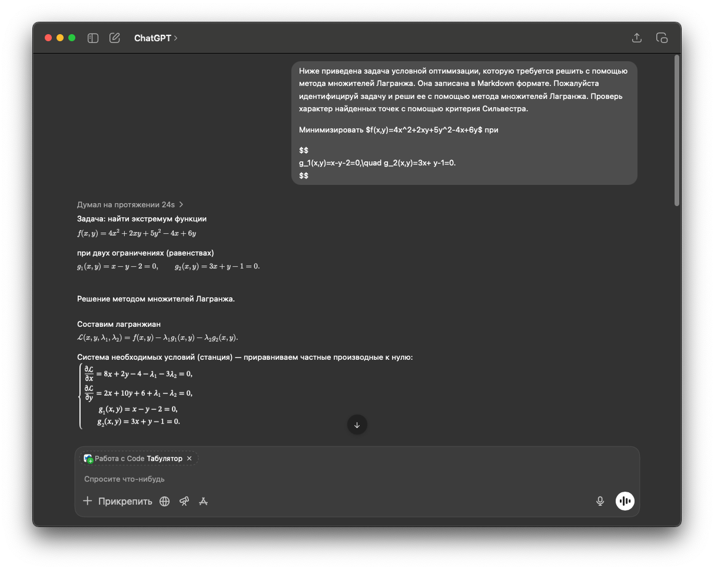
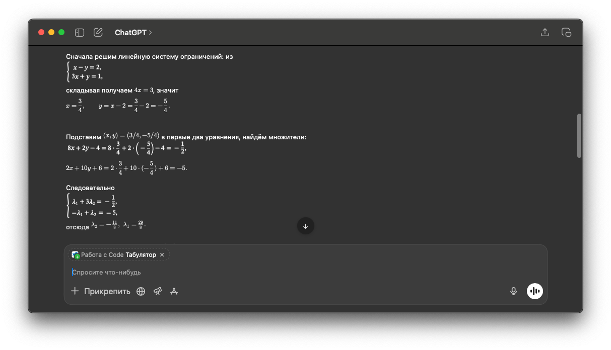
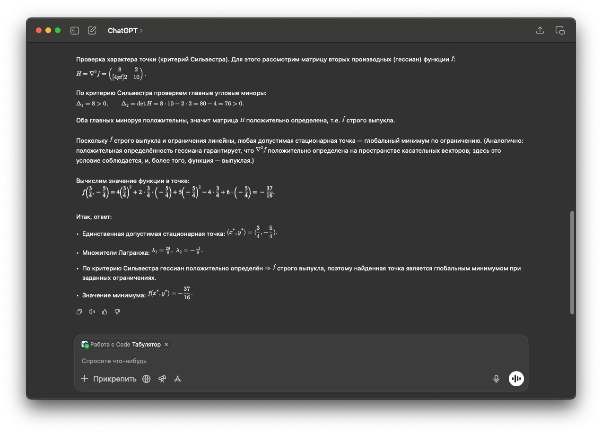
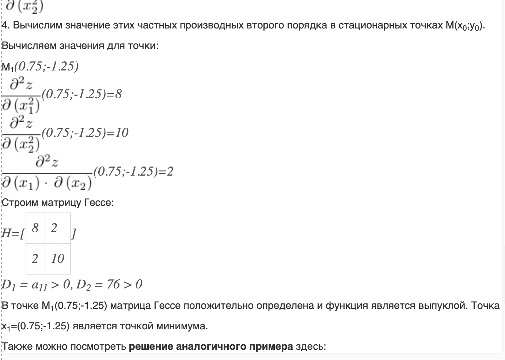

# Отчет по выполнению работы: Метод множителей Лагранжа

Преображенский Артемий Евгеньевич, поток 1.1

Вариант: 

f(x,y)=4x²+2xy+5y²−4x+6y, 

g₁: x−y−2=0, 

g₂: 3x+y−1=0

[Подкаст](https://drive.google.com/file/d/1C1rPWqRWEE49rPvQ0TBNWb_9H2su__e5/view?usp=sharing)

## Задача

Требуется решить задачу условной оптимизации с двумя равенствами. Решение получено с помощью БЯМ; ниже — скриншоты и мои пояснения.

## Описание решения

Сначала приводится исходная функция и оба ограничения. Затем записан лагранжиан — стандартная комбинация функции и ограничений с множителями. Далее берутся частные производные лагранжиана по x и y и добавляются сами ограничения. Получается система уравнений, от которой и нужно отталкиваться.

---

Затем решается система ограничений. Она линейная: из неё сразу находятся x = 3/4 и y = –5/4. Значения удовлетворяют обоим уравнениям, то есть решение определено правильно. После этого найденные x и y подставляются в выражения для производных лагранжиана, и остаётся система уже только для множителей. Решение этой системы даёт λ₁ = 29/8 и λ₂ = –11/8.

---

В финале проверяется характер точки. Для этого используется гессиан исходной функции f. Его главные миноры оказываются положительными, значит матрица положительно определена. Так как функция выпуклая, при линейных ограничениях найденная точка является точкой минимума. Вывод корректный.

---

## Итоги
- Стационарная точка: (x*, y*) = (3/4, −5/4)  
- Множители Лагранжа: λ₁ = 29/8, λ₂ = −11/8  
- Значение функции: f(x*, y*) = −37/16  
- Характер точки: минимум

Также дополнительно была произведена проверка через онлайн-калькулятор:

## Рефлективное заключение

Работа с задачей показала, что БЯМ уверенно справляется с методическими шагами метода Лагранжа: корректно формирует лагранжиан, выводит систему уравнений и последовательно решает её. При этом решение получилось полностью правильным с использованием критерия Сильвестра, не ограничившись только рассмотрением стационарной точки.