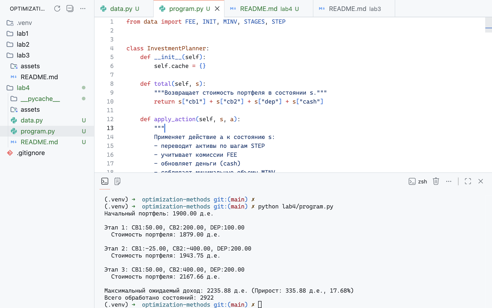

# Отчет по выполнению работы — задача пошагового управления инвестиционным портфелем  
Преображенский Артемий Евгеньевич, поток 1.1

[Подкаст](https://drive.google.com/file/d/1Sw64ecPmC5jnwXlbMSAz1TCTBNIllPqE/view?usp=sharing)


---

## 1) Цель работы и постановка задачи
Цель — спланировать поэтапные покупки/продажи двух типов ценных бумаг и депозитов, чтобы максимизировать ожидаемую итоговую стоимость портфеля за три этапа при заданных вероятностях рыночных сценариев. Учитываются комиссии, минимальные объёмы и ограничение по свободным средствам.

Исходные данные
- Начальное состояние: ЦБ1=100, ЦБ2=800, Деп.=400, cash=600, итого 1900 д.е.
- Шаги управления: STEP = {cb1:25, cb2:200, dep:100}
- Минимумы: MINV = {cb1:30, cb2:150, dep:100}
- Комиссии: FEE = {cb1:0.04, cb2:0.07, dep:0.05}
- Три этапа; на каждом — три сценария (благопр., нейтр., негатив.) с заданными вероятностями и коэффициентами (см. STAGES в коде).

Ограничения: нельзя брать кредит (затраты на покупку с учётом комиссии $\leq$ cash), нельзя опустить активы ниже MINV, cash $\geq 0$.

---

## 2) Общая математическая формулировка (DP)
Пусть $s_k = (\text{cb1}, \text{cb2}, \text{dep}, \text{cash})$ — состояние на шаге $k$. Управление $u_k = (\Delta\text{cb1}, \Delta\text{cb2}, \Delta\text{dep})$ — целые числа (число пакетов).  
Функция перехода $f(s_k, u_k, w_k)$ — применение управления (минусы/плюсы пакетов с учётом комиссий → обновлённый cash и активы) и затем влияние рыночного сценария $w_k$ (умножение активов на соответствующие коэффициенты; cash не меняется от рынка).  
Цель: максимизировать ожидаемую итоговую стоимость портфеля после последнего этапа.

---

## 3) Рекуррентное соотношение Беллмана 

Рекуррентное соотношение Беллмана:

$$F_k(s) = \max_{u \in U(s)} \mathbb{E}_w \left[ F_{k+1}\bigl( f(s, u, w) \bigr) \right]$$

Граничное условие:

$$F_N(s) = V(s) = \text{cb1} + \text{cb2} + \text{dep} + \text{cash}$$

Обратный проход:
- Вычисляем $F_k(s)$ для всех релевантных состояний $s$ от $k = N-1$ до $0$
- Используем мемоизацию для ускорения вычислений

Прямой проход:
- Из начального состояния выбираем оптимальные действия $u_k$, найденные на обратном проходе
- Формируем ожидаемое состояние портфеля после каждого $u_k$, учитывая вероятности рыночных сценариев (критерий Байеса)

---

## 4) Обозначения, постановка и рекуррентное соотношение конкретно для задачи
- $s = \{\text{cb1}, \text{cb2}, \text{dep}, \text{cash}\}$  
- $u = \{d_1, d_2, d_d\}$ — целые пакеты для каждого актива
- Стоимость операции (учёт комиссии): для каждой позиции $k$ вычисляем $c = d \cdot \text{STEP}_k$; при $c > 0$ (покупка) умножаем на $(1 + \text{FEE}_k)$, при $c < 0$ (продажа) — на $(1 - \text{FEE}_k)$. Сумма $c$ — расход/выручка, применяется к cash: $\text{cash}' = \max(0, \text{cash} - \sum c)$.
- Ограничения: $\text{cb1}' \geq \text{MINV}_{\text{cb1}}$, $\text{cb2}' \geq \text{MINV}_{\text{cb2}}$, $\text{dep}' \geq \text{MINV}_{\text{dep}}$, $\text{cost} \leq \text{cash}$.
- Рекуррент: то же, что в секции 3, конкретно реализовано в методе `bellman(k, s)`.

---

## 5) Псевдокод
```
Алгоритм ДП для максимизации ожидаемой стоимости портфеля:

Вход:
  INIT = {cb1, cb2, dep, cash}    — начальное состояние портфеля
  STEP = {cb1, cb2, dep}          — размеры шагов управления
  MINV = {cb1, cb2, dep}          — минимальные объёмы активов
  FEE  = {cb1, cb2, dep}          — комиссии брокеров
  STAGES[k][i] = (p, k1, k2, kd)  — вероятность и коэффициенты сценария i на этапе k

Функция total(s):
  вернуть s.cb1 + s.cb2 + s.dep + s.cash

Функция apply_action(s, a):
  cost = 0
  для каждого актива k в {cb1, cb2, dep}:
    c = a[k] * STEP[k]
    если c > 0: c *= (1 + FEE[k])     // покупка с комиссией
    иначе:      c *= (1 - FEE[k])     // продажа с комиссией
    cost += c
  вернуть {
    cb1:  s.cb1 + a.cb1 * STEP[cb1],
    cb2:  s.cb2 + a.cb2 * STEP[cb2],
    dep:  s.dep + a.dep * STEP[dep],
    cash: s.cash - cost
  }

Функция apply_situation(s, k, idx):
  (_, k1, k2, kd) = STAGES[k][idx]
  вернуть {
    cb1:  s.cb1 * k1,
    cb2:  s.cb2 * k2,
    dep:  s.dep * kd,
    cash: s.cash
  }

Функция actions(s):
  результат = []
  для d1 от -3 до 3:
    для d2 от -3 до 3:
      для dd от -3 до 3:
        a = {cb1: d1, cb2: d2, dep: dd}
        
        // Проверка минимальных ограничений
        если s.cb1 + d1 * STEP[cb1] < MINV[cb1]: продолжить
        если s.cb2 + d2 * STEP[cb2] < MINV[cb2]: продолжить
        если s.dep + dd * STEP[dep] < MINV[dep]: продолжить
        
        // Проверка достаточности средств (суммарная стоимость)
        cost = вычислить_стоимость(a)
        если cost > s.cash: продолжить
        
        результат.добавить(a)
  вернуть результат

Функция bellman(k, s):
  key = (k, округлить(s))
  если key в cache: вернуть cache[key]
  
  // База рекурсии
  если k == количество_этапов:
    вернуть (total(s), None)
  
  best_value = -∞
  best_action = None
  
  для каждого действия a в actions(s):
    ns = apply_action(s, a)
    expected_value = 0
    
    // Взвешивание по вероятностям сценариев (критерий Байеса)
    для sit от 0 до 2:
      (p, _, _, _) = STAGES[k][sit]
      ns2 = apply_situation(ns, k, sit)
      (fv, _) = bellman(k + 1, ns2)
      expected_value += p * fv
    
    если expected_value > best_value:
      best_value = expected_value
      best_action = a
  
  cache[key] = (best_value, best_action)
  вернуть (best_value, best_action)

Функция solve():
  s = INIT
  path = []
  
  для k от 0 до количество_этапов - 1:
    (_, a) = bellman(k, s)
    ns = apply_action(s, a)
    
    // Ожидаемое состояние (по всем сценариям)
    exp = {cb1: 0, cb2: 0, dep: 0, cash: ns.cash}
    для каждого (p, k1, k2, kd) в STAGES[k]:
      exp.cb1 += p * ns.cb1 * k1
      exp.cb2 += p * ns.cb2 * k2
      exp.dep += p * ns.dep * kd
    
    path.добавить((a, ns))
    s = exp
  
  вернуть (total(s), path)

Запуск:
  (value, path) = solve()

Вывод:
  Максимальный ожидаемый доход = value
  Оптимальная стратегия = path
```

## 6) Диаграмма классов
В коде применена простая процедурно-объектная структура:

- `InvestmentPlanner` — основной класс, содержит:
  - `cache` — словарь для мемоизации;
  - `total(s)` — возвращает суммарную стоимость состояния;
  - `apply_action(s, a)` — применяет действие с учётом шагов и комиссий, возвращает новое состояние;
  - `apply_sit(s, k, idx)` — применяет один сценарий рынка (коэффициенты из STAGES) к состоянию;
  - `actions(s)` — генерация допустимых действий (диапазон шагов от $-3$ до $3$ с проверкой MINV и суммарной стоимости $\leq$ cash);
  - `bellman(k, s)` — рекурсивный DP с мемоизацией и критерием Байеса;
  - `solve()` — прямой проход, собирает путь оптимальных действий.
- Модуль `data` хранит константы: FEE, INIT, MINV, STAGES, STEP.

---

## 7) Демонстрационные примеры 



---

## 8) Заключение
Сделано:
- формализована задача управления портфелем в терминах DP;
- выписано и реализовано рекуррентное соотношение Беллмана;
- реализован класс `InvestmentPlanner` с мемоизацией, генерацией действий, учётом комиссий и ограничений;
- получена оптимальная стратегия и численный результат (см. раздел 7).

Чему научился:
- как переводить экономическую задачу в DP-модель.
